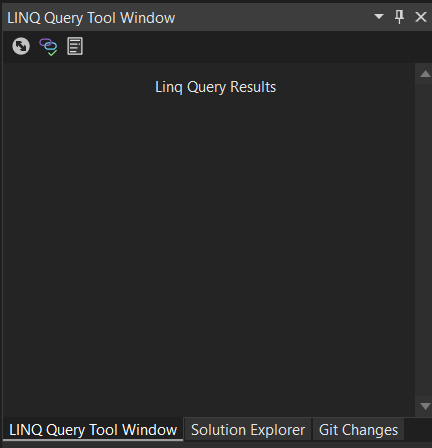

### [Walkthrough: Create Custom Language Editor](#Walkthrough-Create-Custom-Language-Editor)

The walkthrough will show you how to create a Custom Language Editor.

Walkthrough system requirements:

- [Visual Studio 2022](https://visualstudio.microsoft.com/vs/)
- [.Net 6.x](https://dotnet.microsoft.com/en-us/download/dotnet/6.0)
- [VsixCommunity
Community.VisualStudio.Toolkit](https://github.com/VsixCommunity/Community.VisualStudio.Toolkit) installed

This walkthrough example, when completed, will allow you to select a LINQ query
line or Method in your CSharp Project files, click a button in the `LINQ Query Tool
Window` and the selected LINQ query will be compiled and the results of the LINQ
Query will be displayed in the Custom LINQ Editor Window, opened in either a Preview Tab
or not. Using the following code, you have the option where to display the
temporary LINQ Query. The advantage of using the
`VS.Documents.OpenInPreviewTabAsync` method, is that it is automatically removes
the previous compile LINQ Query Windows tab each time you select and test a LINQ query. Keeping your
Visual Studio document tab space cleaner.


```csharp
if (LinqAdvancedOptions.Instance.OpenInVSPreviewTab == true)
{
	await VS.Documents.OpenInPreviewTabAsync(tempQueryPath);
}
else
{
	await VS.Documents.OpenAsync(tempQueryPath);
}
```


This Language Editor's current features are:

-   CSharp Code Syntax Colorzation Support (Note: Our use of .linq files are created as CSharp files and use
	syntax and formatted provide by the CSharp Compiler but have a .linq file extension.)

-   IntelliSense Support

-   ToolWindow Support

	-   Toolbar in ToolWindow

		-   Toolbar buttons in ToolWindow

		-   ToolWindow Messenger Support

-   Select LINQ Queries and create new temporary tab document, display in
	document in temporary view tab, and return query results in the `LINQ Query
	Tool Window`.

-   LINQ language file extension `.linq`

-   IVsRunningDocTableEvents document events support

	-   OnBeforeDocumentWindowShow (Before `.linq` extension document is
		displayed in tabbed documents view.)

		-   OnAfterDocumentWindowHide (When `.linq` extension document is
			removed from tabbed documents view. Note `.Linq` extension documents
			are temporary documents, and are deleted when removed/hidden from
			the Visual Studio Editor.)

-   Code Formatting

-   Light Bulb Suggestions

-   Tools Options and Settings Support

## [Creating a Visual Studio 2022 CSharp Extension Project](#Create-Visual-Studio-2022-CSharp-Extension)

### [Getting Started](#Getting-Started):

In Visual Studio 2022 install: (If you don’t’ already have it.) [VsixCommunity
Community.VisualStudio.Toolkit](https://github.com/VsixCommunity/Community.VisualStudio.Toolkit)
then create a new Visual Studio 2022 CSharp Extension using the:
`VSIX Project w/Tool Window (Community) Project Template`


Create New project in Visual Studio 2022


Select the `VSIX Project w/Tool Window (Community) Project Template`


Name the new extension project LinqLanguageEditor2022


Solution Explore should look like this now:


Add NuGet Packages:

- Microsoft.CodeAnalysis
- Microsoft.CodeAnalysis.CSharp
- Microsoft.CodeAnalysys.CSharp.Scripting
- Microsoft.CSharp


Now would be a good time if you do not already have it installed.  [Add New File (64-bit)](https://marketplace.visualstudio.com/items?itemName=MadsKristensen.AddNewFile64) extension from the Visual Studio Marketplace


Once the [Add New File (64-bit)](https://marketplace.visualstudio.com/items?itemName=MadsKristensen.AddNewFile64) extension is installed.

Right-click on the project and click: Add then: New Empty File...


Add a new CSharp file to the project, name it Constants.cs:


In the Constants.cs file change the class visibility from public to internal and add the following constants.

```csharp
internal class Constants
{
	public const string LinqLanguageName = "Linq";
	public const string LinqExt = ".linq";
	public const string LinqTmpExt = ".tmp";
	public static string[] CommentChars = new[] { "///", "//" };
	public const string LinqBaselanguageName = "CSharp";
	public const string NoActiveDocument = "No Active Document View or LINQ Query Selection!\r\nPlease Select LINQ Query Statement in Active Document,\r\nthen try again!";
	public const string RunningSelectQuery = "Running Selected LINQ Query.\r\nPlease Wait!";
	public const string ResultDump = "result.Dump()";
	public const string NoActiveDocumentMethod = "No Active Document View or LINQ Query Method Selection!\r\nPlease Select LINQ Query Method in Active Document,\r\nthen try again!";
	public const string CurrentSelectionQueryMethod = "Current Selection Query Method Results";
	public const string CurrentSelectionQuery = "Current Selection Query Results";
	public const string RunningSelectQueryMethod = "Running Selected LINQ Query Method.\r\nPlease Wait!";
	public const string QueryKindStatement = "<Query Kind='Statements' />";
	public const string QueryKindMethod = "<Query Kind='Program' />";
	public const string QueryStartsWith = "<Query Kind=";
	public const string VoidMain = "void Main()";
	public const string ExceptionIn = "Exception in ";
	public const string ExceptionCall = "Call. ";
	public const string FileLPRun7Args = "-fx=6.0";
	public const string LinpPadDump = "LinqPad Dump";
	public const string PaneGuid = "67f4110b-fefe-4a06-a6e8-5d33bd66a58f";
	public const string RunSelectedLinqStatement = "Run Selected LINQ Query Statement.";
	public const string RunSelectedLinqMethod = "Run Selected LINQ Query Method.";
	public const string RunEditorLinqQuery = "Run LINQ Query File.";
	public const string LinqEditorToolWindowTitle = "LINQ Query Tool Window";
	public const string SolutionToolWindowsFolderName = "ToolWindows";
	public const string ProvideFileIcon = "KnownMonikers.RegistrationScript";
	public const string ProvideMenuResource = "Menus.ctmenu";
	public const string LinqAdvancedOptionPage = "Advanced";
	public const string CodeStyleGeneralOptionPage = @"Code Style\General";
	public const string CodeStyleIndentationOptionPage = @"Code Style\Formatting\Indentation";
	public const string CodeStyleNewLineOptionPage = @"Code Style\Formatting\New lines";
	public const string CodeStyleSpacingOptionPage = @"Code Style\Formatting\Spacing";
	public const string CodeStyleWrappingOptionPage = @"Code Style\Formatting\Wrapping";
	public const string IntelliSenseOptionPage = "IntelliSense";
	public const string LinqStatementTemplate = "using System;\r\nusing System.Collections.Generic;\r\nusing System.Diagnostics;\r\nusing System.Linq;\r\nusing System.Text;\r\nusing System.Threading.Tasks;\r\nnamespace {namespace}\r\n{\r\n\tpublic class {itemname}\r\n\t{\r\n\t\tpublic static void {methodname}()\r\n\t\t{\r\n\t\t\t{$}\r\n\t\t}\r\n\t}\r\n}";
	public const string LinqMethodTemplate = "using System;\r\nusing System.Collections.Generic;\r\nusing System.Diagnostics;\r\nusing System.Linq;\r\nusing System.Text;\r\nusing System.Threading.Tasks;\r\nnamespace {namespace}\r\n{\r\n\tpublic class {itemname}\r\n\t{\r\n\t\t{$}\r\n\t}\r\n}";
}
```

## [ToolWindow Features](#ToolWindow-Features)

In Solution Explorer open the ToolWindows\MyToolWindow.cs file.

Right-Click on the Class name `MyToolWindow` then click Rename


Rename it to `LinqToolWindow` and make sure you check:

- Include comments
- Include strings
- Rename symbol's file
- Preview changes

Click Apply:


Then Click Apply in `Preview Changes-Rename`:


In Solution Explorer Right-Click `MyToolWindowControl.xaml` file and click Rename:

Rename the file to `LinqToolWindowControl.xaml` and hit enter key.

In Solution Explorer Right-Click `MyToolWindowCommand.cs` file and click Rename:
Rename the file to `LinqToolWindowCommand.cs` and hit enter key.

Click Yes to the pop-up Dialog:


Solution Explorer should now look like this:


At this point the project will build without issues.


## [Update Package file](#Update-Package-file)

Open the package file `LinqLanguageEditor2022Package.cs`.

Add `ProvideToolWindowVisibility` attribute lines under the `ProvideToolWindow` attribute:

```CSharp
[ProvideToolWindowVisibility(typeof(LinqToolWindow.Pane), VSConstants.UICONTEXT.SolutionHasSingleProject_string)]
[ProvideToolWindowVisibility(typeof(LinqToolWindow.Pane), VSConstants.UICONTEXT.SolutionHasMultipleProjects_string)]
[ProvideToolWindowVisibility(typeof(LinqToolWindow.Pane), VSConstants.UICONTEXT.NoSolution_string)]
[ProvideToolWindowVisibility(typeof(LinqToolWindow.Pane), VSConstants.UICONTEXT.EmptySolution_string)]
```

So now the Package file attributes should look like this:

```CSharp
[PackageRegistration(UseManagedResourcesOnly = true, AllowsBackgroundLoading = true)]
[InstalledProductRegistration(Vsix.Name, Vsix.Description, Vsix.Version)]
[ProvideToolWindow(typeof(LinqToolWindow.Pane), Style = VsDockStyle.Tabbed, Window = WindowGuids.SolutionExplorer)]
[ProvideToolWindowVisibility(typeof(LinqToolWindow.Pane), VSConstants.UICONTEXT.SolutionHasSingleProject_string)]
[ProvideToolWindowVisibility(typeof(LinqToolWindow.Pane), VSConstants.UICONTEXT.SolutionHasMultipleProjects_string)]
[ProvideToolWindowVisibility(typeof(LinqToolWindow.Pane), VSConstants.UICONTEXT.NoSolution_string)]
[ProvideToolWindowVisibility(typeof(LinqToolWindow.Pane), VSConstants.UICONTEXT.EmptySolution_string)]
[ProvideMenuResource("Menus.ctmenu", 1)]
[Guid(PackageGuids.LinqLanguageEditor2022String)]
```

Add a `ProvideFileIcon` attribute after the last ProvideToolWindowVisibility attribute:

```CSharp
[ProvideFileIcon(Constants.LinqExt, Constants.ProvideFileIcon)]
```

We now have the File Icon set to our `Constants.LinqExt` (.linq) and an Icon image using the `KnownMonikers.RegistrationScript`

Change the line from this:

```CSharp
[ProvideMenuResource("Menus.ctmenu", 1)]
```

To this:

```CSharp
[ProvideMenuResource(Constants.ProvideMenuResource, 1)]
```


At this point the project should still build without issues.


## [Create a LINQ Editor Factory](#Create-LINQ-Editor-Factory)

In Solution Explorer right-click the project and click `Add` then `New Empty File...`

In the Add New File (64-bit) dialog enter `LinqEditor\LinqLanguageFactory.cs` then click `Add file`.


In Solution Explorer open `VSCommandTable.vsct` file: (Note: This is an xml file.)

In the `<Symbols>` section above the first `<GuidSymbol>` section add the line below then update to Guid `{0CA07535-1A01-485D-9E65-59B7384A593C}` to a new Guid value.

```xml
<GuidSymbol name="LinqEditorFactory" value="{0CA07535-1A01-485D-9E65-59B7384A593C}" />
```

So from this:

```xml
<Symbols>
<GuidSymbol name="LinqLanguageEditor2022" value="{fbcd0cc8-7332-4a38-ad18-4d271e337600}">
	<IDSymbol name="MyCommand" value="0x0100" />
</GuidSymbol>
</Symbols>
```

To this:

```xml
<Symbols>
	<GuidSymbol name="LinqEditorFactory" value="{0CA07535-1A01-485D-9E65-59B7384A593C}" />
	<GuidSymbol name="LinqLanguageEditor2022" value="{fbcd0cc8-7332-4a38-ad18-4d271e337600}">
	<IDSymbol name="MyCommand" value="0x0100" />
</GuidSymbol>
</Symbols>
```

Now rename the `MyCommand` name in two places iside of `VSCommandTable.vsct` file.

Rename `MyCommand` to `LinqToolWindowCommand`.

Rename `<ButtonText>My Tool Window</ButtonText>` to `<ButtonText>LINQ Query Tool Window</ButtonText>`

Save the `VSCommandTable.vsct` file.

Now when we build we get our first build error:

> Error	CS0117	'PackageIds' does not contain a definition for 'MyCommand'	LinqLanguageEditor2022

To fix this double click the error in the Error List window. It will open LinqToolWindowCommand.cs file.

Rename `[Command(PackageIds.MyCommand)]` to `[Command(PackageIds.LinqToolWindowCommand)]` and save the file.

Should build without issues now.

## [Add Toolbar and Buttons to ToolWindow](#Add-Toolbar-and-Buttons-to-ToolWindow)

In the `VSCommandTable.vsct` file under the `<Symbols>` section Add below the `LinqCommand` line:

```xml
<IDSymbol name="LinqTWindowToolbar" value="0x1000" />
<IDSymbol name="LinqTWindowToolbarGroup" value="0x1050" />
```

It should look like this now:

```xml
<Symbols>
	<GuidSymbol name="LinqEditorFactory" value="{0CA07535-1A01-485D-9E65-59B7384A593C}" />
	<GuidSymbol name="LinqLanguageEditor2022" value="{fbcd0cc8-7332-4a38-ad18-4d271e337600}">
		<IDSymbol name="LinqToolWindowCommand" value="0x0100" />
		<IDSymbol name="LinqTWindowToolbar" value="0x1000" />
		<IDSymbol name="LinqTWindowToolbarGroup" value="0x1050" />
	</GuidSymbol>
</Symbols>
```

Now add the `ToolWindowToolbar` `<Menus>` to the `VSCommandTable.vsct` file, inside of the `<Commands package` section and above the `<Buttons>` section:

```xml
<Commands package="LinqLanguageEditor2022">
	<!--This section defines the elements the user can interact with, like a menu command or a button or combo box in a toolbar. -->
	<Menus>
		<Menu guid="LinqLanguageEditor2022" id="LinqTWindowToolbar" type="ToolWindowToolbar">
			<CommandFlag>DefaultDocked</CommandFlag>
			<Strings>
				<ButtonText>Tool Window Toolbar</ButtonText>
			</Strings>
		</Menu>
	</Menus>
```

Now add the `LinqEditorGroup` and `LinqTWindowToolbar` groups to file just below the `</Menus>` element your just added:

```xml
<Groups>
	<Group guid="LinqLanguageEditor2022" id="LinqEditorGroup" priority="9000">
		<Parent guid="guidSHLMainMenu" id ="IDM_VS_CTXT_CODEWIN"/>
	</Group>
	<Group guid="LinqLanguageEditor2022" id="LinqTWindowToolbarGroup" priority="0x0000">
		<Parent guid="LinqLanguageEditor2022" id="LinqTWindowToolbar" />
	</Group>
</Groups>
```


Solution should build without issues.

Open the package file `LinqLanguageEditor2022Package.cs`.

Add a using statement:

```CSharp
using LinqLanguageEditor2022.LinqEditor;
```

Add the `ProvideLanguageService` attribute line:

```CSharp
[ProvideLanguageService(typeof(LinqLanguageFactory), Constants.LinqLanguageName, 0, ShowHotURLs = false, DefaultToNonHotURLs = true, EnableLineNumbers = true, EnableAsyncCompletion = true, EnableCommenting = true, ShowCompletion = true, AutoOutlining = true, CodeSense = true)]
```

Should look like this now:

```CSharp
[PackageRegistration(UseManagedResourcesOnly = true, AllowsBackgroundLoading = true)]
[InstalledProductRegistration(Vsix.Name, Vsix.Description, Vsix.Version)]
[ProvideToolWindow(typeof(LinqToolWindow.Pane), Style = VsDockStyle.Tabbed, Window = WindowGuids.SolutionExplorer)]
[ProvideToolWindowVisibility(typeof(LinqToolWindow.Pane), VSConstants.UICONTEXT.SolutionHasSingleProject_string)]
[ProvideToolWindowVisibility(typeof(LinqToolWindow.Pane), VSConstants.UICONTEXT.SolutionHasMultipleProjects_string)]
[ProvideToolWindowVisibility(typeof(LinqToolWindow.Pane), VSConstants.UICONTEXT.NoSolution_string)]
[ProvideToolWindowVisibility(typeof(LinqToolWindow.Pane), VSConstants.UICONTEXT.EmptySolution_string)]
[ProvideFileIcon(Constants.LinqExt, Constants.ProvideFileIcon)]
[ProvideMenuResource(Constants.ProvideMenuResource, 1)]
[Guid(PackageGuids.LinqLanguageEditor2022String)]

[ProvideLanguageService(typeof(LinqLanguageFactory), Constants.LinqLanguageName, 0, ShowHotURLs = false, DefaultToNonHotURLs = true, EnableLineNumbers = true, EnableAsyncCompletion = true, EnableCommenting = true, ShowCompletion = true, AutoOutlining = true, CodeSense = true)]
```


Edit the `LinqLanguageFactory.cs` class and change the class visibility to internal and add the following code:

Add using statment:

```CSharp
using System.ComponentModel.Composition;
```

Update Class code to:

```CSharp
[ComVisible(true)]
[Guid(PackageGuids.LinqEditorFactoryString)]
internal sealed class LinqLanguageFactory : LanguageBase
{
	[Export]
	[Name(Constants.LinqLanguageName)]
	[BaseDefinition("code")]
	[BaseDefinition("Intellisense")]
	[BaseDefinition(Constants.LinqBaselanguageName)]
	internal static ContentTypeDefinition LinqContentTypeDefinition { get; set; }

	[Import]
	internal IEditorOptionsFactoryService EditorOptions { get; set; }

	[Export]
	[FileExtension(Constants.LinqExt)]
	[ContentType(Constants.LinqLanguageName)]
	[BaseDefinition("code")]
	[BaseDefinition("Intellisense")]
	[BaseDefinition(Constants.LinqBaselanguageName)]
	internal static FileExtensionToContentTypeDefinition LinqFileExtensionDefinition { get; set; }

	[Export]
	[Name(Constants.LinqLanguageName)]
	[BaseDefinition(Constants.LinqBaselanguageName)]
	internal static ClassificationTypeDefinition LinqDefinition { get; set; }

	public LinqLanguageFactory(object site) : base(site)
	{ }

	public override string Name => Constants.LinqLanguageName;

	public override string[] FileExtensions { get; } = new[] { Constants.LinqExt };


	public override void SetDefaultPreferences(LanguagePreferences preferences)
	{
		preferences.EnableCodeSense = true;
		preferences.EnableMatchBraces = true;
		preferences.EnableMatchBracesAtCaret = true;
		preferences.EnableShowMatchingBrace = true;
		preferences.EnableCommenting = true;
		preferences.HighlightMatchingBraceFlags = _HighlightMatchingBraceFlags.HMB_USERECTANGLEBRACES;
		preferences.LineNumbers = true;
		preferences.MaxErrorMessages = 100;
		preferences.AutoOutlining = true;
		preferences.MaxRegionTime = 2000;
		preferences.InsertTabs = true;
		preferences.IndentSize = 2;
		preferences.IndentStyle = IndentingStyle.Smart;
		preferences.ShowNavigationBar = true;
		preferences.EnableFormatSelection = true;

		preferences.WordWrap = true;
		preferences.WordWrapGlyphs = true;

		preferences.AutoListMembers = true;
		preferences.HideAdvancedMembers = false;
		preferences.EnableQuickInfo = true;
		preferences.ParameterInformation = true;
	}

	public override void Dispose()
	{
		base.Dispose();
	}
}
```

## [Register the Language Factory](#Register-the-Language-Factory)

In the `LinqLanguageEditor2022Package.cs` file, under the Task InitializeAsync method of the LinqLanguageEditor2022Package Class, Register the Language Factory by add this code:

```CSharp
LinqLanguageFactory LinqLanguageEditor2022 = new(this);
RegisterEditorFactory(LinqLanguageEditor2022);
```

The LinqlanguageEditor2022Package Class should look like this now:

```CSharp
public sealed class LinqLanguageEditor2022Package : ToolkitPackage
{
	protected override async Task InitializeAsync(CancellationToken cancellationToken, IProgress<ServiceProgressData> progress)
	{
		LinqLanguageFactory LinqLanguageEditor2022 = new(this);
		RegisterEditorFactory(LinqLanguageEditor2022);
		await this.RegisterCommandsAsync();

		this.RegisterToolWindows();
	}
}
```

Solution should build without issues.


## [Add Messenger Service to Package, to handle ToolWindow Toolbar button Commands](#Add-Messenger-Service-to-Package-to-handle-commands)

In Solution Explorer right-click the project and click `Add` then `New Empty File...`

Name the file: `LinqToolWindowMessenger.cs`

Update the LinqToolWindowMessenger Class as follows:

```CSharp
public class LinqToolWindowMessenger
{
	public void Send(string message)
	{
		// The tooolbar button will call this method.
		// The tool window has added an event handler
		MessageReceived?.Invoke(this, message);
	}

	public event EventHandler<string> MessageReceived;

}
```

In the `LinqLanguageEditor2022Package.cs` file, under the Task InitializeAsync method of the LinqLanguageEditor2022Package Class, Register the Language Factory by add this code:

add this code:

```CSharp
AddService(typeof(LinqToolWindowMessenger), (_, _, _) => Task.FromResult<object>(new LinqToolWindowMessenger()));
((IServiceContainer)this).AddService(typeof(LinqLanguageFactory), LinqLanguageEditor2022, true);
```

Then Add these attributes:

```CSharp
[ProvideLanguageExtension(typeof(LinqLanguageFactory), Constants.LinqExt)]
[ProvideEditorFactory(typeof(LinqLanguageFactory), 740, CommonPhysicalViewAttributes = (int)__VSPHYSICALVIEWATTRIBUTES.PVA_SupportsPreview, TrustLevel = __VSEDITORTRUSTLEVEL.ETL_AlwaysTrusted)]
[ProvideEditorExtension(typeof(LinqLanguageFactory), Constants.LinqExt, 65536, NameResourceID = 740)]
[ProvideEditorLogicalView(typeof(LinqLanguageFactory), VSConstants.LOGVIEWID.TextView_string, IsTrusted = true)]
```

Save the `LinqLanguageEditor2022Package.cs`.

In the Xaml change the UserControl Name from `Name="MyToolWindow"` to `Name="LinqToolWindow"`.

Change the Xaml Class line from:

```xml
<UserControl x:Class="LinqLanguageEditor2022.MyToolWindowControl"
```

To this:

```xml
<UserControl x:Class="LinqLanguageEditor2022.LinqToolWindowControl"
```

Save the `LinqToolWindowControl.xaml` file.


In the `LingToolWindowsControl.xaml.cs` file update the class name and Constructor names from:

```CSharp
public partial class MyToolWindowControl : UserControl
{
	public MyToolWindowControl()
	{
		InitializeComponent();
	}

	private void button1_Click(object sender, RoutedEventArgs e)
	{
		VS.MessageBox.Show("LinqLanguageEditor2022", "Button clicked");
	}
}
```

To this and also remove the button1_Click event handler since it was part of the template and we will not be using it.
```CSharp
public partial class LinqToolWindowControl : UserControl
{
	public LinqToolWindowControl()
	{
		InitializeComponent();
	}
}
```

Add one public variable to the `public partial class LinqToolWindowControl : UserControl`:

```CSharp
public partial class LinqToolWindowControl : UserControl
{
	public LinqToolWindowMessenger ToolWindowMessenger = null;
```

Update the Constructor to support the `LingToolWindowMessenger`:

Change this:

```CSharp
public LinqToolWindowControl()
{
	InitializeComponent();
}
```

To this:

```CSharp
public LinqToolWindowControl(LinqToolWindowMessenger toolWindowMessenger)
{
	ThreadHelper.ThrowIfNotOnUIThread();
	InitializeComponent();
	if (toolWindowMessenger == null)
	{
		toolWindowMessenger = new LinqToolWindowMessenger();
	}
	ToolWindowMessenger = toolWindowMessenger;
	toolWindowMessenger.MessageReceived += OnMessageReceived;
}
```

Add and empty `OnMessageReceived` Event Handler, we will update it later to support what to do with the messages received.

```CSharp
private void OnMessageReceived(object sender, string e)
{
}
```

You `LinqToolWindowsControl` class should look like this now:

```CSharp
public partial class LinqToolWindowControl : UserControl
{
	OutputWindowPane _pane = null;
	public LinqToolWindowMessenger ToolWindowMessenger = null;
	public LinqToolWindowControl(LinqToolWindowMessenger toolWindowMessenger)
	{
		ThreadHelper.ThrowIfNotOnUIThread();
		InitializeComponent();
		if (toolWindowMessenger == null)
		{
			toolWindowMessenger = new LinqToolWindowMessenger();
		}
		ToolWindowMessenger = toolWindowMessenger;
		toolWindowMessenger.MessageReceived += OnMessageReceived;
	}
	private void OnMessageReceived(object sender, string e)
	{
	}
}
```


Save the `LingToolWindowsControl.xaml.cs` file.

You now need to fix a issue in `LingToolWindow.cs` file since it returns a task base on the MyToolWindowControl we just renamed.

Open the `LingToolWindow.cs` file and change from this: (Note: Make the method async as well.)

```CSharp
public override Task<FrameworkElement> CreateAsync(int toolWindowId, CancellationToken cancellationToken)
{
	return Task.FromResult<FrameworkElement>(new MyToolWindowControl());
}
```

To this:

```CSharp
public override async Task<FrameworkElement> CreateAsync(int toolWindowId, CancellationToken cancellationToken)
{
	LinqToolWindowMessenger toolWindowMessenger = await Package.GetServiceAsync<LinqToolWindowMessenger, LinqToolWindowMessenger>();
	return new LinqToolWindowControl(toolWindowMessenger);
}
```


Solution should build without issues.

In the `LinqToolWindow.cs` file add the Toolbar to the ToolWindow Pane.

Update the public Pane() constructor:

```CSharp
ToolBar = new CommandID(PackageGuids.LinqLanguageEditor2022, PackageIds.LinqTWindowToolbar);
```
Should look like this:

```CSharp
public Pane()
{
	BitmapImageMoniker = KnownMonikers.ToolWindow;
	ToolBar = new CommandID(PackageGuids.LinqLanguageEditor2022, PackageIds.LinqTWindowToolbar);
}
```

Change the LinqToolWindow GetTitle method as follows to rename the Tool Windows Title:

from:
```CSharp
public override string GetTitle(int toolWindowId) => "My Tool Window";
```

To this:
```CSharp
public override string GetTitle(int toolWindowId) => Constants.LinqEditorToolWindowTitle;
```

## [Add Toolbar Buttons to the ToolWindow Toolbar](#Toolbar-Buttons-to-ToolWindow-Toolbar)

In the `VSCommandTable.vsct` file under the `<Symbols>` section Add below the `LinqTWindowToolbarGroup` line:

```xml
<IDSymbol name="DisplayLinqPadStatementsResults" value="0x0111" />
<IDSymbol name="DisplayLinqPadMethodResults" value="0x0112" />
<IDSymbol name="LinqEditorLinqPad" value="0x0114" />
<IDSymbol name="LinqEditorGroup" value="0x0001"/>
```

Now add the buttons in the `<buttons>` section add the following buttons:

```xml
<Button guid="LinqLanguageEditor2022" id="DisplayLinqPadStatementsResults" priority="0x0001" type="Button">
<Parent guid="LinqLanguageEditor2022" id="LinqTWindowToolbarGroup"/>
<Icon guid="ImageCatalogGuid" id="Linq"/>
<CommandFlag>IconIsMoniker</CommandFlag>
<Strings>
	<ButtonText>Run Selected Query Statement!</ButtonText>
</Strings>
</Button>
<Button guid="LinqLanguageEditor2022" id="DisplayLinqPadMethodResults" priority="0x0002" type="Button">
<Parent guid="LinqLanguageEditor2022" id="LinqTWindowToolbarGroup"/>
<Icon guid="ImageCatalogGuid" id="LinkValidator"/>
<CommandFlag>IconIsMoniker</CommandFlag>
<Strings>
	<ButtonText>Run Selected Query Method!</ButtonText>
</Strings>
</Button>
<Button guid="LinqLanguageEditor2022" id="LinqEditorLinqPad" priority="0x0003" type="Button">
<Parent guid="LinqLanguageEditor2022" id="LinqTWindowToolbarGroup"/>
<Icon guid="ImageCatalogGuid" id="Editor"/>
<CommandFlag>IconIsMoniker</CommandFlag>
<Strings>
	<ButtonText>Run Editor Linq Query!</ButtonText>
</Strings>
</Button>
```


Open the Designer for `LinqToolWindowControl.xaml` file:

Replace the existing Grid and it contents with this:

Replace this:

```xml
<Grid>
	<StackPanel Orientation="Vertical">
		<Label x:Name="lblHeadline"
				Margin="10"
				HorizontalAlignment="Center">Title</Label>
		<Button Content="Click me!"
				Click="button1_Click"
				Width="120"
				Height="80"
				Name="button1" />
	</StackPanel>
</Grid>
```

With This:

```xml
<Grid>
	<Grid.ColumnDefinitions>
		<ColumnDefinition Width="*" />
	</Grid.ColumnDefinitions>
	<ScrollViewer Grid.Column="0" HorizontalScrollBarVisibility="Auto">
		<StackPanel Orientation="Vertical">
			<TextBlock Margin="10 10 0 0" HorizontalAlignment="Center" Text="Linq Query Results"></TextBlock>
			<StackPanel Margin="10 10 0 0" Name="LinqPadResults" Orientation="Vertical" HorizontalAlignment="Left" MaxWidth="400" />
		</StackPanel>
	</ScrollViewer>
</Grid>
```

Save the `LinqToolWindowControl.xaml` file.

Now let debug the `LinqLanguageEditor2022` to the Visual Studio 2022 Experimental Instance. 

> (Note: It should run and we should get our ToolWindow with Toolbar and Buttons. 
The Buttons will not do anything yet!)


With Debug set click the 


When the Visual Studio 2022 initial dialog opens, Click the `Continue without code ->` link:


After Visual Studio 2022 fully loads then Click `View` then `Other Windows` and then `LINQ Query Tool Window`.


The `LINQ Query Tool Window` should display:



> (Note: The 3 Buttons will show at the top of the ToolWindow.)

Close the Visual Stuiod 2022 Experimental Instance and stop debugging.

## [Add Events Handlers for the ToolWindow, Toolbar, Buttons](#Add-Events-Handlers-ToolWindow-Toolbar-Buttons)

The ToolWindow Toolbar Buttons Events are Handled as Commands in three Classes.

- LinqPadStatements
- LinqPadMethod
- LinqQueryFileEditor

Right-click on the Commands folder and click: Add then: New Empty File... `LinqPadStatements.cs`


Replace the Public class LinqPadStatements.

Replace This:
```CSharp
	public class LinqPadStatements
	{

	}
```

With This:

```CSharp
[Command(PackageIds.DisplayLinqPadStatementsResults)]
internal sealed class LinqPadStatements : BaseCommand<LinqPadStatements>
{
	protected override async Task ExecuteAsync(OleMenuCmdEventArgs e)
	{
		await ThreadHelper.JoinableTaskFactory.SwitchToMainThreadAsync();
		ThreadHelper.JoinableTaskFactory.RunAsync(async () =>
		{
			LinqToolWindowMessenger messenger = await Package.GetServiceAsync<LinqToolWindowMessenger, LinqToolWindowMessenger>();
			messenger.Send(Constants.RunSelectedLinqStatement);
		}).FireAndForget();
	}
}
```

Right-click on the Commands folder and click: Add then: New Empty File... `LinqPadMethod.cs`


Replace the Public class LinqPadMethod.

Replace This:
```CSharp
public class LinqPadMethod
{

}
```

With This:
```CSharp
[Command(PackageIds.DisplayLinqPadMethodResults)]
internal sealed class LinqPadMethod : BaseCommand<LinqPadMethod>
{
	protected override async Task ExecuteAsync(OleMenuCmdEventArgs e)
	{
		await ThreadHelper.JoinableTaskFactory.SwitchToMainThreadAsync();
		ThreadHelper.JoinableTaskFactory.RunAsync(async () =>
		{
			//await ThreadHelper.JoinableTaskFactory.SwitchToMainThreadAsync();
			LinqToolWindowMessenger messenger = await Package.GetServiceAsync<LinqToolWindowMessenger, LinqToolWindowMessenger>();
			messenger.Send(Constants.RunSelectedLinqMethod);
		}).FireAndForget();
	}
}
```

Right-click on the Commands folder and click: Add then: New Empty File... `LinqQueryFileEditor.cs`


Replace the Public class LinqQueryFileEditor.

Replace This:
```CSharp
public class LinqQueryFileEditor
{

}
```

With This:
```CSharp
[Command(PackageIds.LinqEditorLinqPad)]
internal sealed class LinqQueryFileEditor : BaseCommand<LinqQueryFileEditor>
{
	protected override async Task ExecuteAsync(OleMenuCmdEventArgs e)
	{
		await ThreadHelper.JoinableTaskFactory.SwitchToMainThreadAsync();
		ThreadHelper.JoinableTaskFactory.RunAsync(async () =>
		{
			//await ThreadHelper.JoinableTaskFactory.SwitchToMainThreadAsync();
			LinqToolWindowMessenger messenger = await Package.GetServiceAsync<LinqToolWindowMessenger, LinqToolWindowMessenger>();
			messenger.Send(Constants.RunEditorLinqQuery);
		}).FireAndForget();
	}
}
```

## [Download Full Source Code](#Download-Full-Source-Code)

Get the full source solution for this walkthrough from:
[LinqLanguageEditor2022](https://github.com/SFC-Sarge/LinqLanguageEditor2022)

### [Contribute to LinqLanguageEditor2022 Project](#Contribute-to-LinqLanguageEditor2022-Project)

You are invited to become a Contributor to the [LinqLanguageEditor2022](https://github.com/SFC-Sarge/LinqLanguageEditor2022) project on GitHub.
With you help we can makke it better for all developers.

Possible Changes:

- Replace external dependancy on LINQPad to Compile and return LINQ results with Rosyln, etc.
- Expland current project features.
- Improve performance and threading.
- Enhance the LINQ results display in the tool window.
- Enhance Intellisense.
- Enhance LightBulb features.
- Enhance Code Formatting.

### [Contribute to the VSIX Cookbook Project](#Contribute-to-the-VSIX-Cookbook-Project)

You are invited to become a Contributor to the [VSIX Cookbook](https://github.com/VsixCommunity/docs) project on GitHub.
